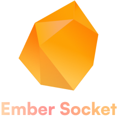

 

  

<h3 align="center">Ember-Socket Spring Application</h3>

  

    Ember is a full-stack web application that allows users to create 
    and join chat rooms with a easy-to-use interface. This repository 
    is the back-end API implementation of the Ember-Socket app, built 
    using Spring Boot, Hibernate, WebSockets, and MongoDB.
     
     
    <a href="/url">View Demo</a>
    ✧
    <a href="https://github.com/openceJav/ember-backend/issues">Report Bug</a>
    ✧
    <a href="https://github.com/openceJav/ember-backend/issues">Request Feature</a>
    ✧
    <a href="">Documentation</a>
  

    
    
    
    
    
    
    
    
    
    
    

 

> [!WARNING]
> Ember-Socket is still currently under development and it not yet ready to be forked or used for any other purpose, as of now there is partial code that has been developed without proper testing and code optimization.  This repository is in tangent with another repository named Ember-Frontend which acts as the visual representation of the chat application.

## Table of Contents

## About The Project

## Installation & Usage

## Features

## Contributing

## License

This project is licensed under the MIT License - see the [LICENSE](LICENSE) file for details.

## Contact

## Acknowledgements
